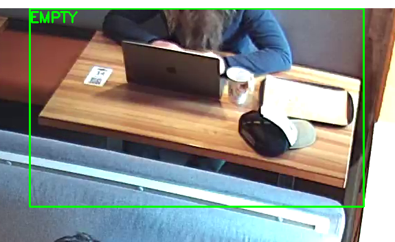

# Прототип системы детекции людей за столиком

## Создание виртуальной среды

```bash

python -m venv venv
source venv/Scripts/activate
```

## Установка зависимостей


```bash

pip install -r requirements.txt
```

## Запуск проекта

```bash

python main.py --video video.mp4
```


## Выбор видео

Видео выбрал 2, столик правый верхний

## Логика детекции

### Детекция людей

Используется YOLO для определения присутствия человека в зоне столика, где класс 0 определяет человека
Зона столика выделяется с помощью мыши в начале запуска скрипта с помощью opencv

### Определение состояний
Состояние	Описание
EMPTY	    Стол пустой, людей нет
APPROACH	Человек появился недавно
OCCUPIED	Человек находится за столом некоторое время

Также используется счетчики кадров, чтобы сгладить шум неопределяемости человека в кадре

### Визуализация

На видео отображается bounding box вокруг выбранного столика
Цвета состояния:
GREEN — EMPTY
YELLOW — APPROACH
RED — OCCUPIED
Метка состояния выводится внутри рамки

## Полученный результат (среднее время задержки для выбранного видео) - 26 секунд


## Пример проблемного кадра

